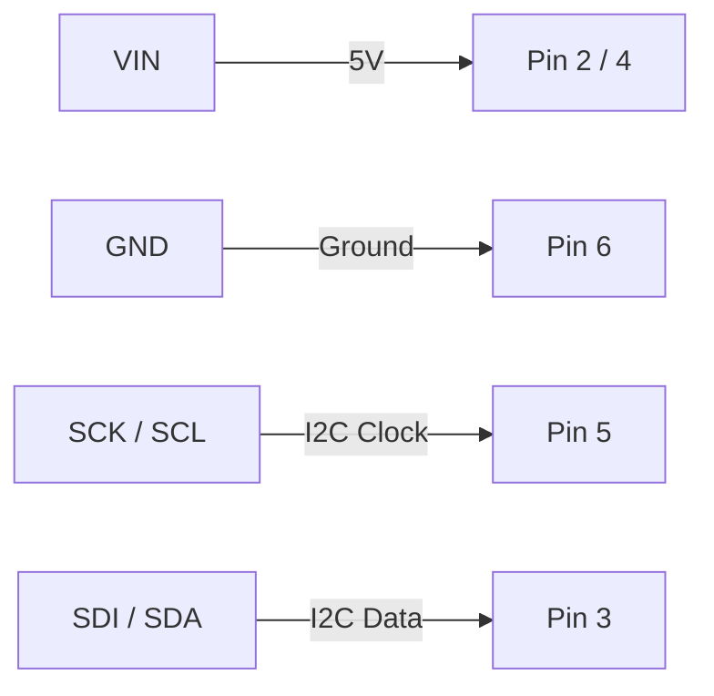

{: width="100" height="100" }
_<a href="https://github.com/jorgem0/raspberry_pi_bme280_mysql" target="_blank" rel="noopener noreferrer">jorgem0/raspberry_pi_bme280_mysql</a>_

## Introduction

This tutorial will use a Raspberry Pi Zero W, a BME280 sensor, and MariaDB in order to collect temperature, pressure, and humidity data and store it in a DBMS.

## Setting Up the Raspberry Pi

The first step for this project is to install the Raspbian Stretch OS for the Raspberry Pi. Download the Raspbian Stretch OS image from the [Raspberry Pi website](https://www.raspberrypi.org/downloads/raspbian/){:target="_blank" rel="noopener noreferrer"} and flash it to your MicroSD card using [Etcher](https://etcher.io){:target="_blank" rel="noopener noreferrer"} as seen in the [Raspberry Pi tutorial](https://www.raspberrypi.org/documentation/installation/installing-images/README.md){:target="_blank" rel="noopener noreferrer"}. Once the process has been completed, insert the MicroSD card into your Raspberry Pi and install the OS (it should install automatically). You will now be greeted with the Raspbian Stretch OS desktop. Go to **Raspberry Pi Configuration** by selecting the menu in the top left corner of the screen. Select the **Interfaces** tab and enable **SSH** and **I2C**. Also set up your Wi-Fi in the top right corner.


_Settings_


_Interfaces and Wi-Fi_

Open up the terminal and type in the command `sudo ifconfig` in order to locate your local IP address which will be used to connect to the Raspberry Pi remotely using PuTTY.


_Local IP Address_

Now open up PuTTY and enter your Raspberry Pi's IP Address in the **Host Name** box. The default user is `pi` and default password is `raspberry`. You can now start installing the necessary packages and libraries for this tutorial.


_PuTTY_

## Installing Necessary Packages and Libraries

The first set of packages and libraries that need to be installed include the Adafruit Python GPIO Library which allows the Raspberry Pi to interact with the sensor. The necessary packages and libraries can be installed with the commands below as stated in the [Adafruit Python GPIO Library GitHub](https://github.com/adafruit/Adafruit_Python_GPIO){:target="_blank" rel="noopener noreferrer"} page.

```bash
sudo apt-get update
sudo apt-get install build-essential python-pip python-dev python-smbus git
git clone https://github.com/adafruit/Adafruit_Python_GPIO.git
cd Adafruit_Python_GPIO
sudo python setup.py install
```

Move one directory up and clone the [Adafruit_Python_BME280](https://github.com/adafruit/Adafruit_Python_BME280){:target="_blank" rel="noopener noreferrer"} and install MySQL as well. Raspberry Pi will install MariaDB instead but the SQL commands that work for MySQL will work with MariaDB. Also install the Python MySQL package `MySQLdb` in order for Python to be able to communicate with MySQL/MariaDB and `vim` to edit text files.

```bash
cd ..
git clone https://github.com/adafruit/Adafruit_Python_BME280.git
sudo apt-get install mysql-server
sudo apt-get install python-mysqldb
sudo apt-get install vim
```

Log in to MySQL with `sudo mysql -u root` and create a database and table in MariaDB in order to enter the BME280 data. I have created a database named `RaspberryPi` and a table named `BME280_Data` with the columns `date_time`, `temperature`, `pressure`, and `humidity`. Also create a new user with the `CREATE USER` command below where `newuser` is the username of the new user and `newuserpassword` is the password of the new user. Grant all privileges for the user. You can exit MariaDB by typing `exit` in the terminal.

```sql
CREATE DATABASE RaspberryPi;
USE RaspberryPi;
CREATE TABLE BME280_Data (date_time VARCHAR(50), temperature FLOAT, pressure FLOAT, humidity FLOAT);
DESCRIBE BME280_Data;

CREATE USER 'newuser'@'localhost' IDENTIFIED BY 'newuserpassword';
GRANT ALL PRIVILEGES ON *.* TO 'newuser'@'localhost';
```


_MariaDB_

## Wiring Raspberry Pi and BME280

The wiring for the BME280 sensor and the Raspberry Pi is seen in the diagram below. This diagram was created using [Fritzing](http://fritzing.org/home/){:target="_blank" rel="noopener noreferrer"}. The pinout diagram for the Raspberry Pi is from [pinout.xyz](https://pinout.xyz){:target="_blank" rel="noopener noreferrer"}. The wires are connected as follows:




_Raspberry Pi and BME280 Diagram_


_Raspberry Pi Zero Pinout Diagram from pinout.xyz_


_BME 280_


_Raspberry Pi Connected_

Type the command `sudo i2cdetect -y 1` in the terminal and you should be able to see the output below if everything is connected correctly.


_i2cdetect_

You can run the Adafruit_BME280_Example.py script with `python Adafruit_BME280_Example.py` in order to see the BME280 sensor data at the time at which the aforementioned script was executed.


_Adafruit BME280 Example Script_

## Python Code